# garmin-padel

padel scorekeeper garmin watch app, available in [garmin connect app store](https://apps.garmin.com/apps/c63edba4-4217-4345-9ebc-86a90307e968?tid=0)

## Functionalities

Keeps full padel match score: sets, games, standard **tie-breaks**, and **super tie-break** when configured.

**Setup**

* **Quick presets**: Tournament (best of 3, golden point, no super tie), Tournament with super tie, **Pro set** tournament (single pro set), **Friendly** (unlimited sets), or **Custom** to tune everything.
* **Custom match**: number of sets (**1**, **3**, **5**, or **unlimited**), **set type** (normal, pro set, or mini set), optional **super tie-break** (when using 3 or 5 sets), and **point rule**:
  * **Golden point** — deuce is decided by the next point
  * **Advantages** — classic advantage / deuce
  * **Silver point** — one advantage cycle; if it returns to deuce again, the next point wins the game
  * **Star point** (FIP-style) — up to two advantage cycles, then a decisive point at deuce

**During play**

* Score with **Up** / **Down** (or top / bottom half of the screen on touch devices).
* Real time **heart rate** on the score screen.
* **Options** menu (**Enter** / **Start**, or **long press** on touch): **undo** last point, track an **unforced error**, or **finish** the activity.

**Activity / Garmin Connect**

* Records a **padel** activity; on save, writes **match score** (full history string), **steps** during the session, **unforced errors** count, and **app version** into the activity for Connect / FIT.

## How to use

### Start and match setup

When you open the app, the initial screen appears. Press `Enter` / `Start`, or tap the screen on a touch device, to continue.

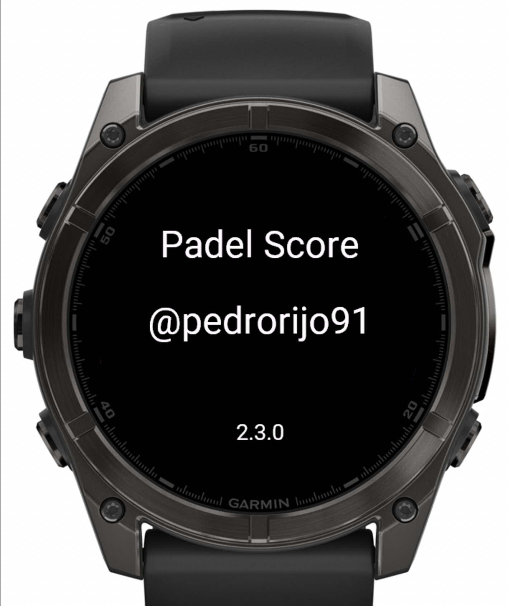

You’ll see the **Game Mode** menu first:

* **Tournament**, **Tournament (super)**, **Pro Set Tournament**, or **Friendly** — pick one, review the summary, then choose **Start match**.
* **Custom** — walk through **Sets** (1 / 3 / 5 / Unlimited) → **Set type** (Normal / Pro set / Mini) → **Super tie** (only for 3 or 5 sets) → **Score** rule (Golden / Star / Advantages / Silver), then start.

Use `Up` / `Down` to move in menus and `Enter` to select. For exact scoring mechanics (set lengths, tie-breaks, deuce rules), see [Match rules reference](#match-rules-reference).

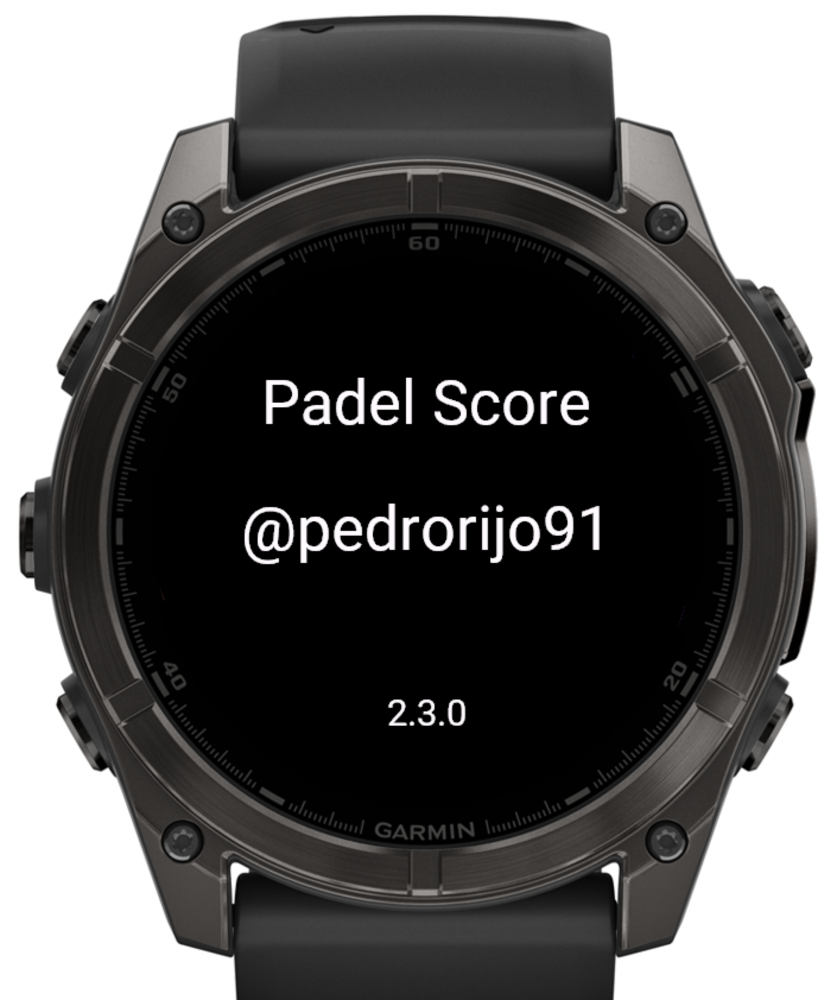

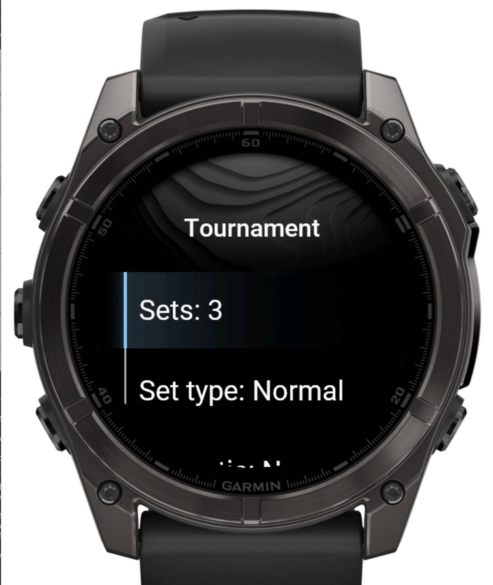

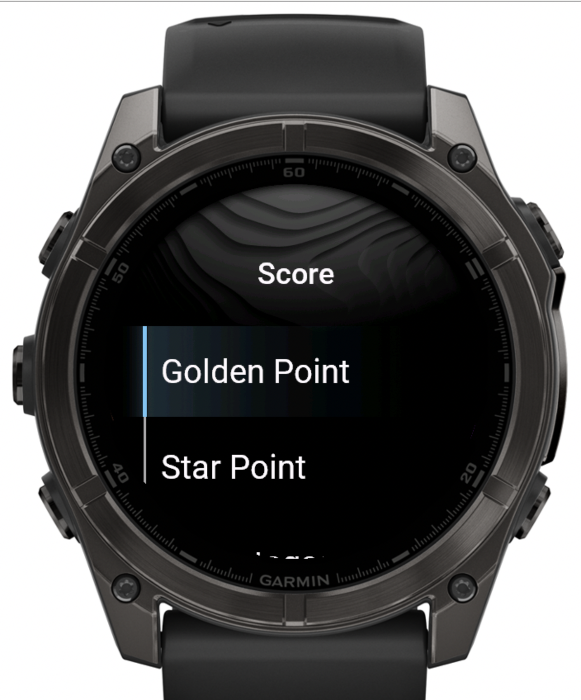

### During the match

The score view shows sets, games, and points (or **Tie** / **Super** when applicable), plus a clock and heart rate. Your team is scored with **`Up`**; the opponent with **`Down`**. On touch devices, tap the **top** half for your point and the **bottom** half for theirs.

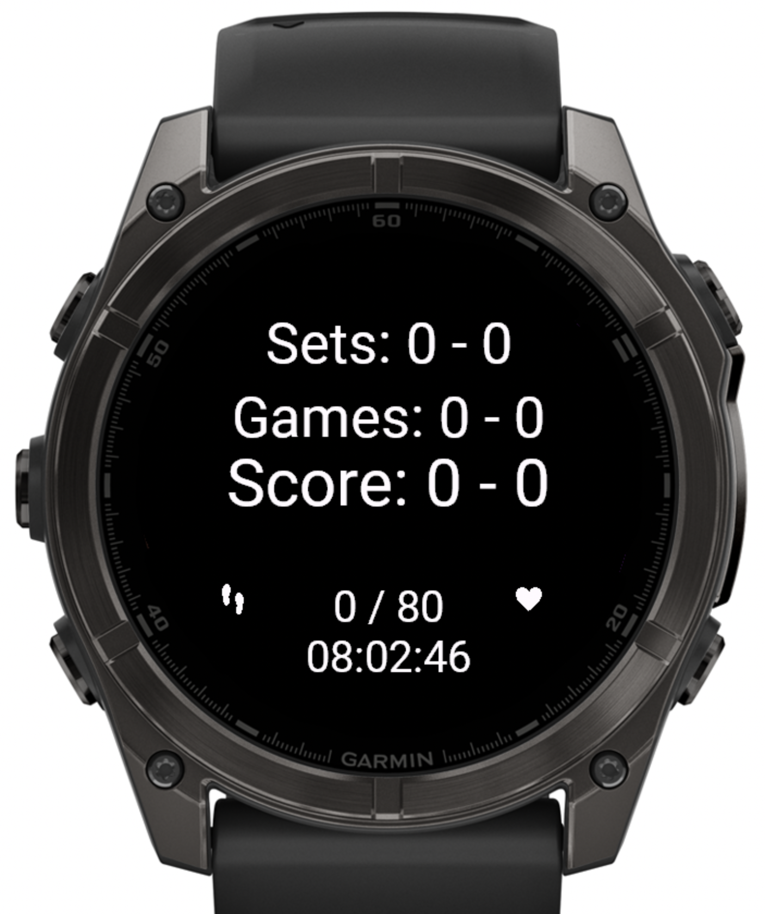

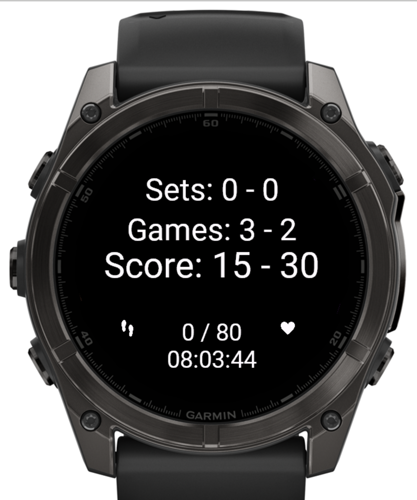

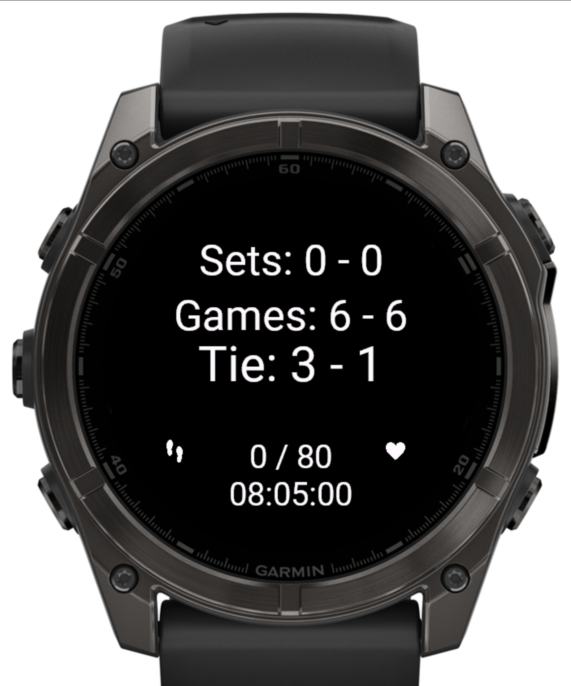

### Options, undo, and finishing

Press **`Enter`** / **`Start`** on the score screen, or **long-press** on a touch device, to open **Options**:

* **Undo last point** — asks for confirmation before reverting.
* **Unforced error** — increments the error counter (also saved with the activity and available in garmin connect later).
* **Finish activity** — **Save and exit**, **Discard**, or **Cancel** back to the score.

Pressing **`Back`** from the score screen opens the same **Finish activity** menu (save, discard, or cancel).

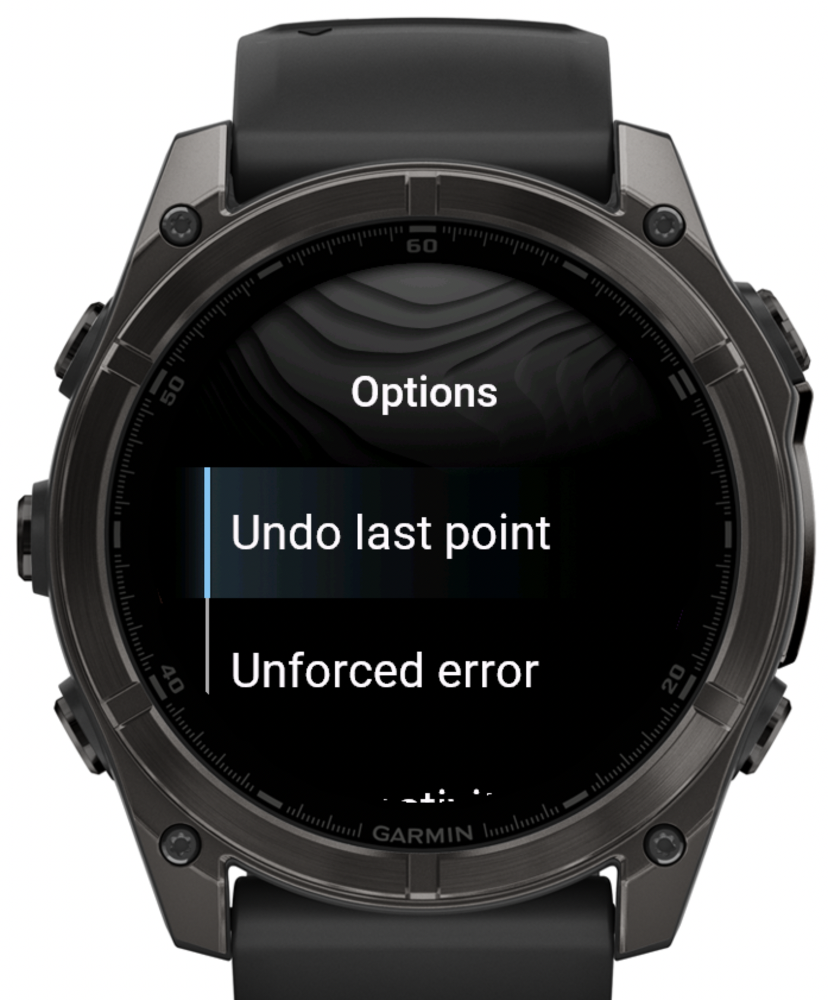

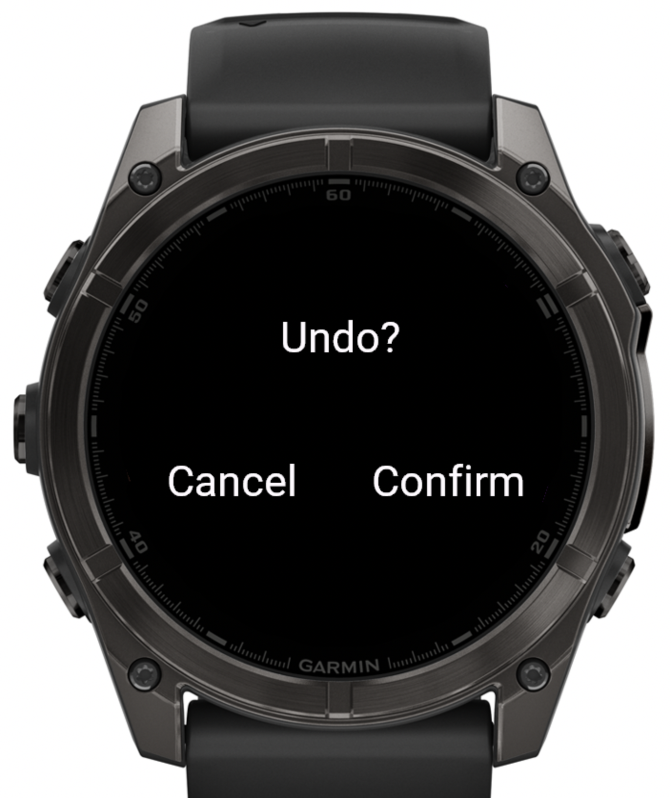

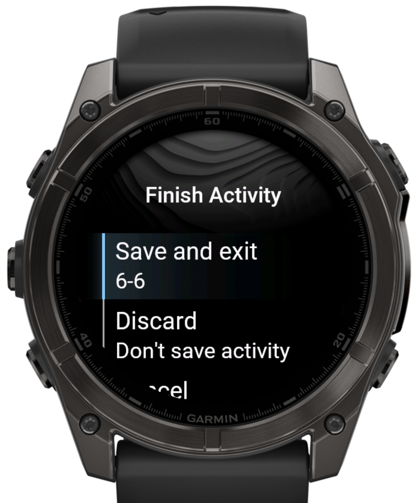

### After the last point (limited matches)

If the match ends because a player/team has won the required sets, a **summary** screen is shown. Press **`Enter`** or tap to open **Finish activity** and save or discard as above.

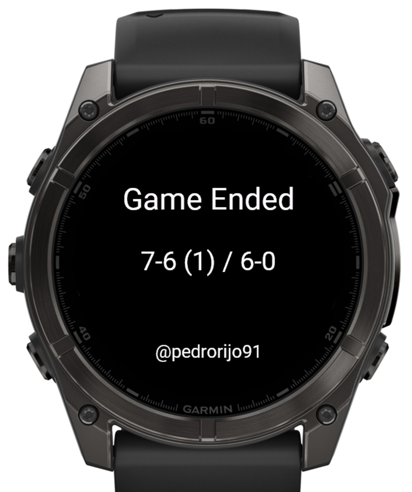

### Garmin Connect

After syncing, open the saved **padel** activity in Garmin Connect to see the recorded **score**, **steps** during the session, **unforced errors**, and **app version** in the activity details (exact layout depends on Connect / device).

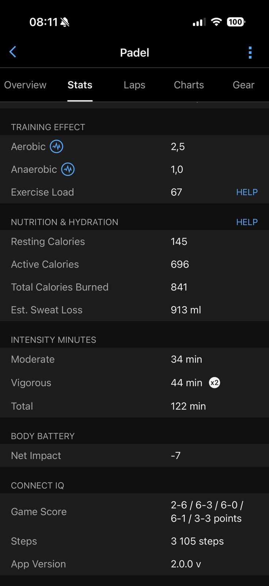

## Match rules reference

This section describes **what the app implements**, not the on-watch menus (those are covered in [How to use](#how-to-use)).

### Match format (sets)

* **1, 3, or 5 sets**: the match ends when one side has won enough sets (e.g. 2 of 3, 3 of 5).
* **Unlimited**: the session does not auto-finish on set count; you end it from **Options** or **Back** when you want to save or discard the activity.

**Super tie-break** can be turned on only when you chose **3** or **5** sets. If sets would end in a draw at the last possible moment (e.g. **1–1** in a best-of-3 match with super tie enabled), the **deciding set is not played as games**: it is a single **super tie-break** (see below).

### Set types (games within a set)

All set types use **standard padel-style game scoring** (0 → 15 → 30 → 40, then game / deuce, depending on the **point rule** you picked). **Tie-breaks** inside a set are **first to 7 points, win by 2**.

| Set type | Win the set | Tie-break when |
|----------|-------------|----------------|
| **Normal** | First to **6** games, **win by 2** | **6–6** |
| **Pro set** | First to **9** games, **win by 2** | **8–8** |
| **Mini** | Games start at **2–2**; first to **6** games, **win by 2** | **5–5** |

### Super tie-break (deciding set)

When the match configuration uses a super tie for the decider, that **entire final “set”** is a **super tie-break**: **first to 10 points, win by 2**. There are no games inside that set.

### Point rules at deuce (40–40)

These options only change what happens when a game reaches **40–40** (deuce):

* **Golden point** — the **next** point wins the game.
* **Advantages** — classic **advantage / deuce**: after deuce, a side needs **advantage** and then **another** point to win the game; losing advantage returns to deuce.
* **Silver point** — like advantages, but each time play returns to deuce **after** the receiving side had **advantage**, a counter advances. After **one** such return to deuce, the **next** time the score is 40–40, the **following point** wins the game (no further advantage play in that game).
* **Star point** (FIP-style) — same hybrid idea as Silver, but **two** returns to deuce from that advantage situation are allowed before the next 40–40 point becomes **decisive** (wins the game).

### Tie-break scoring (within a set)

During a normal set **tie-break** (not the super tie), the UI shows **Tie:** *points–points*. Points are counted numerically; win the tie-break by reaching **7** points with a **margin of 2**.

## List of supported devices

See `<iq:products>` element in [manifest.xml](https://github.com/pedrorijo91/garmin-padel/blob/main/manifest.xml#L16) file.

While there's nothing preventing other devides to be supported, due to limited access to test on other devices, support is only focused on the following ranges at this moment:

* garmin forerunner (165, 245, 265, 645, 735, 745, 935, 945, 965)
* garmin fenix 5, 6, 7, 8 (s/X/pro)
* garmin epix 2
* garmin descent mk2i/mk2s, mk3

Feel free to raise an issue asking support for any specific device.

Note: api level by device listed in [garmin dev docs](https://developer.garmin.com/connect-iq/compatible-devices/)

## Garmin Connect app link

available in [garmin connect app store](https://apps.garmin.com/apps/c63edba4-4217-4345-9ebc-86a90307e968?tid=0)

## Maintainer / development

Release workflow and developer resource links: [RELEASING.md](RELEASING.md).
