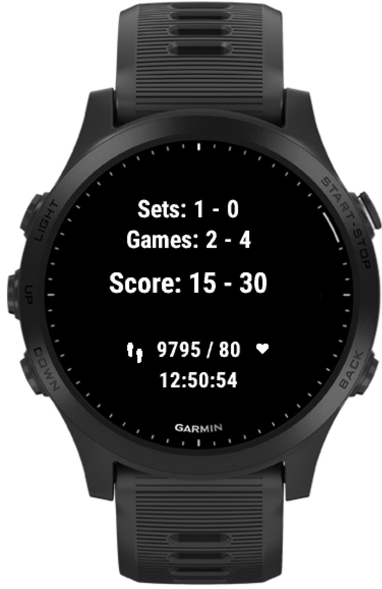
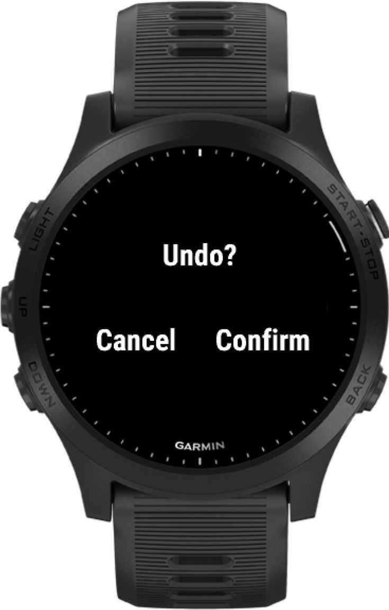

# garmin-padel

padel scorekeeper garmin watch app, available in [garmin connect](https://apps.garmin.com/en-US/apps/697552d2-271d-40cc-a059-08a936f63993)

<a href="https://www.buymeacoffee.com/pedrorijo91" target="_blank"></a>

## Functionalities

Keeps track of padel match score.

* display current hearth rate and steps
* Configure number of sets (or unlimited)
* Configure Super tie break
* Configure between Advantages and Golden Point scores.
* Tie break
* Save game score in activity details
* Save steps in activity details
* Undo scores

Other work to be done is listed in [GitHub issues](https://github.com/pedrorijo91/garmin-padel/issues)

## How to use

After starting the application, the initial screen will show up:

<p align="center"></p>

Just click the `Enter` button to enter the menu where you can configure the match settings. See the corresponding [section](https://github.com/pedrorijo91/garmin-padel#available-game-configurations) for more details on available game options.

Use the `Up` and `Down` buttons on your device to scroll on each configuration, and use the `Enter`button to select.

After selecting all the options the score screen will display:

<p align="center"></p>

Now you can control the score by clicking the `Up` and `Down` buttons on your device. By clicking `Up`, you'll increment your team score, and by clicking `Down` you'll increment opponent score. If you have a touchscreen device, clicking on the top half and bottom half will have the same effect:

<p align="center"></p>

<p align="center"></p>

If you clicked in the wrong player, you can revert the last score by pressing the `Enter`/`Start` key. If you are using a touchscreen device this can be achieved with a long press in the screen:

<p align="center"></p>

If you selected a limited amount of sets (current options are 3, 5, or unlimited sets), when the game is over you'll see a final screen with the game summary:

<p align="center"></p>

If you select unlimited sets, to finish the activity at any moment, just click the `Back` button and confirm you wish to finish it:

<p align="center"></p>

After syncing with your Garmin Connect account, you'll be able to see some custom information about the match, such as game result.

## Available Game Configurations

### golden point

This app allows to configure the score rules with either:

* Golden Point: if 40-40, the first to win a point, wins the game
* Advantages: if 40-40, the first point becomes advantage, and only if the same team wins another point it will win the game. How we usually see in tennis matches. 

<p align="center"></p>

<p align="center"></p>

### number of sets

It is possible to configure the maximum number of sets for your game:

* 3 sets
* 5 sets
* unlimited sets, useful for friendly matches that don't have a limited number of sets.

<p align="center"></p>

### super tie break

You can also configure if the game should have super tie break in case of tie in sets. This option is only available if you select a limited number of sets in the previous step

If you choose to have super tie break, then in case of a tie, the last set will be a super tie (like a tie break, but until 10 and difference of 2 points). This means that if you select best of 3 sets, the third will be tie if it reaches 1-1 in sets. Similarly, if you select best of 5 sets, the fifth set will be a super tie if the score is 2-2 in sets.

<p align="center"></p>

<p align="center"></p>

## List of supported devices

See `<iq:products>` element in [manifest.xml](https://github.com/pedrorijo91/garmin-padel/blob/main/manifest.xml#L16) file.

While there's nothing preventing other devides to be supported, due to limited access to test on other devices, support is only focused on the following ranges at this moment:

* garmin forerunner (165, 245, 265, 645, 735, 745, 935, 945, 965)
* garmin fenix 5, 6, 7, 8 (s/X/pro)
* garmin epix 2
* garmin descent mk2i/mk2s, mk3

Feel free to raise an issue asking support for any specific device.

Note: api level by device listed in [garmin dev docs](https://developer.garmin.com/connect-iq/compatible-devices/)

## Garmin Connect app link

* Public app link: https://apps.garmin.com/en-US/apps/697552d2-271d-40cc-a059-08a936f63993
* Beta link: https://apps.garmin.com/en-US/apps/e1d39ed9-b37d-4082-a375-a9ccdf78194f

## Releasing

From the repository root just run:

```
$ sh releases/scripts/release_all.sh
```

and follow the instructions displayed after finishing building the binary

### Resources

icons
* https://www.iconfinder.com/search?q=&iconset=octicons

docs
* Garmin connect API docs: https://developer.garmin.com/connect-iq/api-docs/
* Garmin SDK docs: https://developer.garmin.com/connect-iq/core-topics/
* Garmin dev forum: https://forums.garmin.com/developer/
* devices capabilities: https://developer.garmin.com/connect-iq/reference-guides/devices-reference/#devicereference

other apps
* from https://github.com/search?l=Monkey+C&q=garmin&type=Repositories:
* https://github.com/matco/badminton
* https://github.com/viorelyo/ChairUmpire
* https://apps.garmin.com/en-US/apps/5bf8f979-52ea-4124-be63-e9ff9ba81026

FIT file viewer:
* https://www.fitfileviewer.com/
