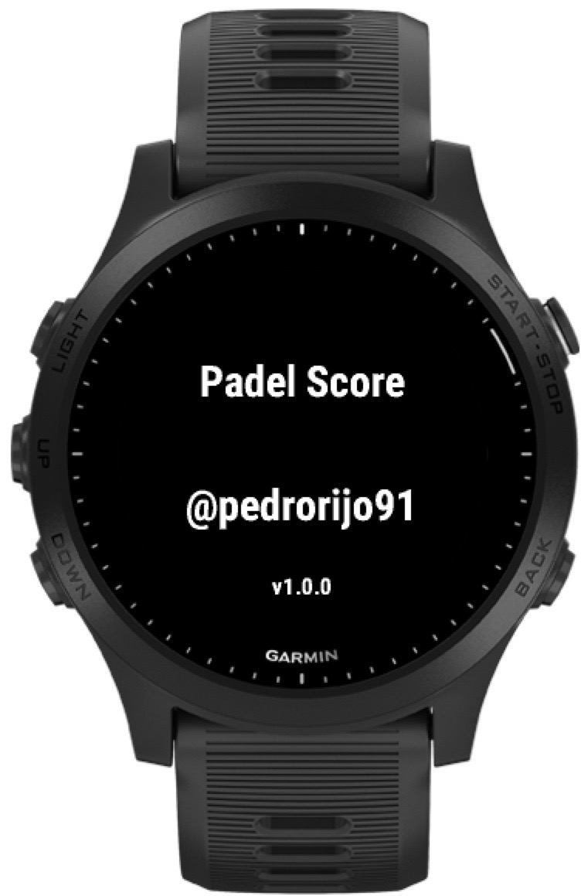
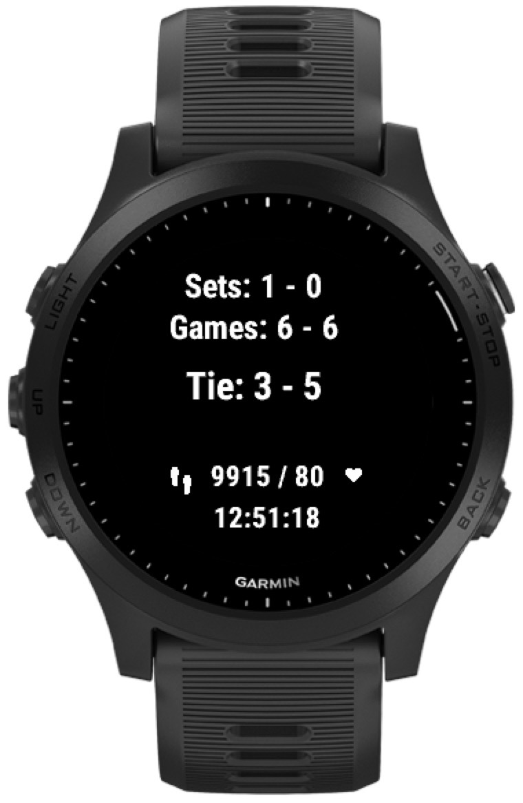

# garmin-padel

padel scorekeeper garmin watch app, available in [garmin connect](https://apps.garmin.com/en-US/apps/e1d39ed9-b37d-4082-a375-a9ccdf78194f)

## Functionalities

Keeps track of padel match score.

* golden point 
* Tie break
* Unlimited sets
* Save game score in activity details
* display current hearth rate

Not yet supported:

* advantages support - [github issue](https://github.com/pedrorijo91/garmin-padel/issues/1)
* Super tie break - [github issue](https://github.com/pedrorijo91/garmin-padel/issues/3)
* Configure number of sets - [github issue](https://github.com/pedrorijo91/garmin-padel/issues/17)
* Display who should be serving - [github issue](https://github.com/pedrorijo91/garmin-padel/issues/6)
* Revert scores - [github issue](https://github.com/pedrorijo91/garmin-padel/issues/5)

Other work to be done listed in [GitHub issues](https://github.com/pedrorijo91/garmin-padel/issues)

## How to use

After starting the application, the initial screen will show up:

Just click any button and the score screen will display:

Now you can control the score by clicking the `Up` and `Down` buttons on your device. By clicking `Up`, you'll increment your team score, and by clicking `Down` you'll increment opponent score:

To finish the activity, just click the `Back` button.

After syncing with your Garmin Connect accountm you'll be able to see some custom information about the match.

## List of supported devices

See `<iq:products>` element in [manifest.xml](https://github.com/pedrorijo91/garmin-padel/blob/main/manifest.xml#L16) file.

While there's nothing preventing other devides to be supported, due to limited access to test on other devices, support is only for the following:

* garmin forerunner 945

Feel free to raise an issue asking support for any specific device.

Note: api level by device listed in [garmin dev docs](https://developer.garmin.com/connect-iq/compatible-devices/)

## Garmin Connect app link

See [https://apps.garmin.com/en-US/apps/e1d39ed9-b37d-4082-a375-a9ccdf78194f](https://apps.garmin.com/en-US/apps/e1d39ed9-b37d-4082-a375-a9ccdf78194f)

### Resources

other apps from https://github.com/search?l=Monkey+C&q=garmin&type=Repositories:

* https://github.com/matco/badminton
* https://github.com/viorelyo/ChairUmpire
* https://apps.garmin.com/en-US/apps/5bf8f979-52ea-4124-be63-e9ff9ba81026
